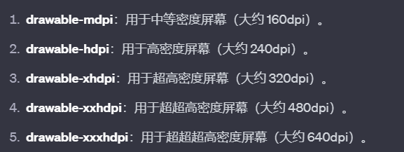
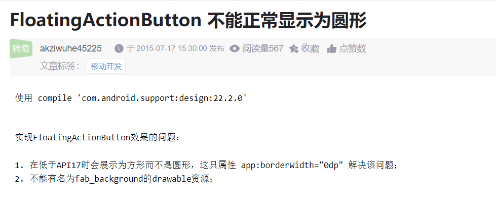

##  ECloset（E衣柜）开发日志

> 华东师范大学2023移动应用开发大作业
>
> 本项目有参照市面上“搭搭APP”页面设计和板块，是个人学习项目

- **存在的问题**

1. 

- **已完成**

1. 利用lottie实现启动App的动画（12.8）
2. 设计好了登录界面（12.8）

3. 利用viewPager滑动Fragment（平时作业实现过了）


- ##### 踩坑

1. `drawable` 文件夹用于存储图形资源，PNG图片往往按不同尺寸存放，用来适配不同屏幕密度的设备。



2. 借助Android Studio生成图标（图片）的xml文件：[CSDN博客](https://blog.csdn.net/gongjing457/article/details/126149840?ops_request_misc=&request_id=&biz_id=102&utm_term=android%E4%B8%AD%E5%A6%82%E4%BD%95%E5%88%9B%E5%BB%BA%E5%9B%BE%E6%A0%87%E8%B5%84%E6%BA%90%E6%96%87%E4%BB%B6&utm_medium=distribute.pc_search_result.none-task-blog-2~all~sobaiduweb~default-1-126149840.142^v96^pc_search_result_base7&spm=1018.2226.3001.4187)

3. 后面发现bottomAppbar作为底部导航栏不是很明智的选择，最后采用透明BottomNavigationView实现BottomAppBar导航

   参考：[CSDN博客](https://blog.csdn.net/weixin_44759237/article/details/128667949?ops_request_misc=&request_id=&biz_id=102&utm_term=android%20%E5%BC%80%E5%8F%91%20bottomappbar&utm_medium=distribute.pc_search_result.none-task-blog-2~all~sobaiduweb~default-5-128667949.142pc_search_result_base7&spm=1018.2226.3001.4187)

4. `com.google.android.material:material`升级到1.8.0的坑，最后的解决，修改了版本。

   ```
   implementation("com.google.android.material:material:1.6.0")
   implementation("androidx.constraintlayout:constraintlayout:2.1.4")
   ```




